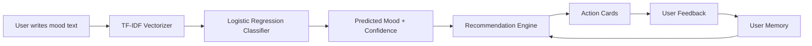

# Mood Flow

<p align="center">
  <b>AI-powered mood detection and personalized action recommendations built with Streamlit.</b>
</p>

<p align="center">
  <a href="https://mooodflow.streamlit.app/">
    
  </a>
  <a href="https://github.com/ashishkumar2005/mood-flow">
    
  </a>
  
  
</p>

## Live App

View the deployed app here:

**[https://mooodflow.streamlit.app/](https://mooodflow.streamlit.app/)**

## Overview

Mood Flow is a machine learning web app that helps users reflect on how they feel and receive simple, mood-aware action suggestions. A user writes a short message such as "I feel stressed about deadlines," and the app predicts the emotional state, displays model confidence, and recommends actions that match the mood.

The project combines a lightweight natural language processing pipeline with a Streamlit interface and a feedback-based recommendation layer.

## Key Features

- Natural language mood detection from user-written text
- TF-IDF based text vectorization
- Logistic Regression mood classifier
- Confidence score display for top mood predictions
- Mood-specific recommendation engine
- Like and dislike feedback for recommendations
- User profile memory with mood history and liked actions
- Professional light-themed Streamlit UI
- Streamlit Community Cloud deployment

## Supported Moods

Mood Flow currently supports these mood categories:

```text
Happy
Sad
Anxious
Bored
Tired
Angry
Excited
Stressed
```

## Tech Stack

| Area | Tools |
| --- | --- |
| Frontend / App UI | Streamlit |
| Programming Language | Python |
| Machine Learning | scikit-learn |
| Text Features | TF-IDF Vectorizer |
| Classifier | Logistic Regression |
| Storage | JSON-based local user memory |
| Deployment | Streamlit Community Cloud |

## How It Works



## Machine Learning Pipeline

1. The user enters a short text description of their current feeling.
2. The text is transformed into numerical features using `TfidfVectorizer`.
3. A `LogisticRegression` model predicts the most likely mood.
4. The app returns the predicted mood and confidence distribution.
5. The recommendation engine selects actions linked to the predicted mood.
6. User feedback is stored and used to improve future ranking.

## Project Structure

```text
mood-flow/
|-- app.py             # Main Streamlit app and UI
|-- engine.py          # Mood classifier, user memory, recommendation engine
|-- data.py            # Mood labels, colors, descriptions, and metadata
|-- model.py           # Mood-to-activity recommendation data
|-- data_handler.py    # JSON data read/write helpers
|-- utils.py           # Helper functions
|-- requirements.txt   # Python dependencies
|-- .gitignore         # Ignored local/cache files
`-- README.md          # Project documentation
```

## Run Locally

Clone the repository:

```bash
git clone https://github.com/ashishkumar2005/mood-flow.git
cd mood-flow
```

Install dependencies:

```bash
pip install -r requirements.txt
```

Run the app:

```bash
streamlit run app.py
```

Then open the local Streamlit URL shown in your terminal.

## Deployment

This project is deployed with Streamlit Community Cloud.

Deployment settings:

```text
Repository: ashishkumar2005/mood-flow
Branch: main
Main file path: app.py
```

Dependencies are installed from:

```text
requirements.txt
```

## What I Learned

This project helped me practice:

- Building an end-to-end Streamlit application
- Creating a simple NLP classification pipeline
- Using scikit-learn models in an interactive app
- Designing a clean user interface with custom CSS
- Managing user feedback and recommendation ranking
- Deploying a Python app publicly with Streamlit Cloud
- Publishing and documenting a project on GitHub

## Future Improvements

- Expand the training dataset for better prediction accuracy
- Add richer mood trend charts and analytics
- Store user memory in a cloud database
- Add authentication for persistent profiles
- Improve recommendation scoring with more feedback signals
- Add more advanced NLP models
- Add automated tests for the classifier and recommendation engine

## Important Note

Mood Flow is a learning and wellness-support project. It is not a medical, diagnostic, or mental health treatment tool.

## Author

Built by [Ashish Kumar](https://github.com/ashishkumar2005).

If you like this project, consider starring the repository.
